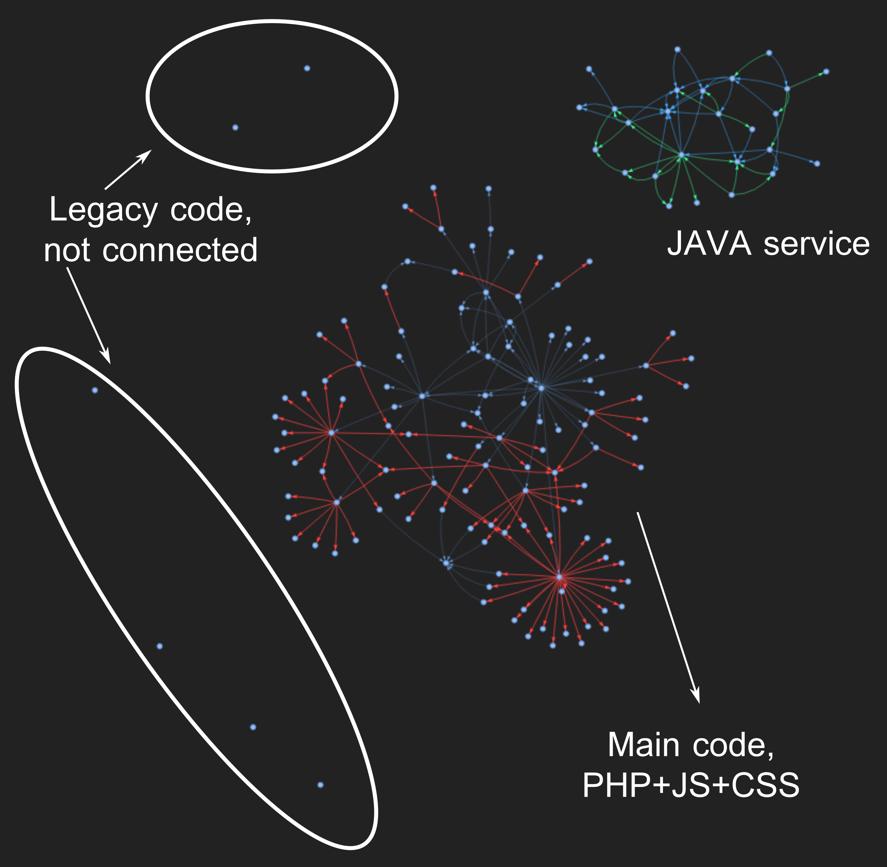

# dependency-graph

A static analysis tool that scans a web project and produces an interactive HTML graph showing how files reference each other.

Designed for projects that mix PHP, JavaScript, Java, HTML, and CSS, with built-in support for PHP API routers where endpoints are defined in a central file and called by name from the front end.




## What it detects

| Connection type | Color | Description |
|---|---|---|
| Filename literal | white / gray | A file's basename appears anywhere in another file's content |
| Import / include | blue | `import ... from`, `require()`, `include`, `require_once`, `include __DIR__ . '...'` |
| API endpoint | red | An endpoint string defined in the PHP router appears in a file |
| Java same-package | green | A class is referenced by type (field, parameter, return value) without an explicit import, because both files are in the same package |

All comment blocks are stripped before scanning so that commented-out references do not produce false edges.


## Requirements

```
pip install networkx pyvis
```


## Usage

```bash
python3 graph.py
```

The output is a single HTML file (`dependency_graph.html` by default) that you can open in any browser. The graph is interactive: nodes can be dragged, zoomed, and clicked.


## Configuration

All settings are at the top of `graph.py`. You only need to touch this section.

```python
# Path to the root of the project you want to analyse.
# Can be relative to the location of graph.py.
PROJECT_ROOT = "../"

# Extensions to include as nodes in the graph.
EXTENSIONS = ('.php', '.js', '.java', '.html', '.css')

# Output filename.
OUTPUT_FILE = "dependency_graph.html"

# The PHP router file. Set to None if your project has no central router.
ROUTER_FILE = "api.php"

# Directories to skip entirely.
EXCLUDED_DIRS = {
    '.git', 'node_modules', '__pycache__',
    'vendor', 'dist', 'build', 'config', 'data',
}

# Individual files to exclude from the graph.
EXCLUDED_FILES = {
    'api.php',
}
```


## PHP router support

This tool was built for a project where all API calls go through a single PHP router file that maps endpoint strings to handler files:

```php
$allowed_routes = [
    'dashboard/get' => '/features/dashboard/api/get_dashboard.php',
    'wallet/deposit' => '/features/wallet/api/post_deposit.php',
    ...
];
```

When the analyser finds a string like `'dashboard/get'` in a front-end file, it draws a red edge to `get_dashboard.php`, even though that filename never appears literally in the front-end file.

**To adapt this to your router:**

1. Open `graph.py` and find the `parse_router` function.
2. Change the regex to match your router's variable name or array syntax:

```python
block_match = re.search(
    r'\$(?:rutas_permitidas|allowed_routes)\s*=\s*\[(.*?)\];',
    ...
)
```

3. If your router uses a completely different format (e.g. a JSON config, a `switch` statement, or a framework's route registration), you will need to rewrite `parse_router` to extract pairs of `(endpoint_string, handler_file)`.

If you do not have a central router, set `ROUTER_FILE = None` and the feature is disabled entirely.


## Adapting for other languages

The detection logic is split into clearly separated steps inside `build_graph`. To add support for a new language or a new import pattern:

- **New file extension:** add it to `EXTENSIONS`.
- **New import syntax:** add a regex branch inside `extract_special_imports`. The function receives the stripped file content, the file extension, and the name-to-path index.
- **New connection type:** add a new `kind` value, draw the edge with `G.add_edge(..., kind='your_type')`, and add a color entry in `build_graph` where the edges are styled.


## Isolated nodes

After generating the graph, the script prints a list of files that have no detected connections. These are worth investigating manually — common causes are:

- The file is only referenced through a pattern the analyser does not yet recognise.
- The file is genuinely unused.
- The file is referenced via a dynamically constructed path (e.g. `include $dir . $name . '.php'`), which static analysis cannot resolve.


## Project structure

```
graph.py        the analyser
README.md       this file
README.es.md    Spanish version
```


## License

GNU
